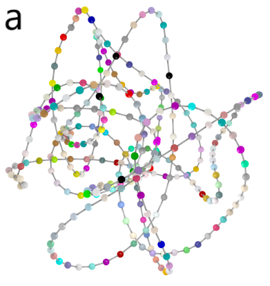

# Appendix C
## BlendNet

|  |  |
| :----: | :----: |

Graph visualization is still an open problem in many applications.
Commonly the problem is related to large graph visualization in which problems arise from the rendering of a large number of nodes and a greater number of links between them.
An other open problem concern the multi-dimensional visualization of the graphs.
Despite the most common graph tools compute the node coordinates in a any space dimensions (and clearly the maximum number of possible dimension for a visualization is still three) the real visualization is often allowed only a 2D space.
The counterpart of these problems concern the pretty visualization of the graphs that it is often ignored in many tools but it can be guarantee a good result, the so called wow-effect, in a presentation.

In this section we introduce a new custom graph viewer developed for pretty small network visualization in 2D and 3D called [BlendNet](https://github.com/Nico-Curti/BlendNet) (*Blender Network viewer*).
BlendNet is open-source and it is released under GPL license.
All the small-graphs showed in this work are made using this tool and in particular the feature-signature generated by the DNetPRO algorithm.

BlendNet is a custom tool written in Python with the help of Blender API.
Blender is now a standard in the 3D rendering and it is commonly used in a wide range of graphical applications, starting from the simpler 3D dynamics to the video-games applications.
Blender is certainly more than a simple graphical viewer but the easy Python interface and the wide on-line documentation and blogs make it a useful tool for graphical representation of 3D structures.

To use the Blender API we are forced to use the Python version installed inside software and any extra-package required by our application have to be installed with the appropriate `pip`.
In our case we base our viewer on the `networkx` library for the computation of the possible node coordinates so we have to update our Python-Blender.
Moreover since the code can be difficult to manage for non-expert users we create an easy user command-line interface to set the whole set of parameters required by the graph visualization that can be piloted by *Makefile* rules.
The list of nodes and edges can be passed via command-line filename in the same format of the concurrent graph viewer (e.g *Gephi* software, the other graph viewer used in this work to generate the largest network structure of the CHIMeRA project).

The software project is a single script file and it includes a full list of possible examples and usages of the software.
Some of this examples are shown in the Figure.
A full list of installation instructions is also given for any operative system (Unix, MacOS and Windows).
These instructions cover a full installation of Blender, Python and BlendNet package either for admin users either for no-root users [[Shut](https://github.com/Nico-Curti/Shut)].
With slight modifications of the code we can obtain different nodes coordinates and a node shapes.
Nodes color, size and position can also be given in the node-list file as independent columns.

