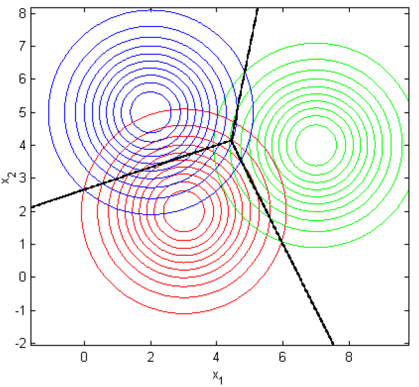
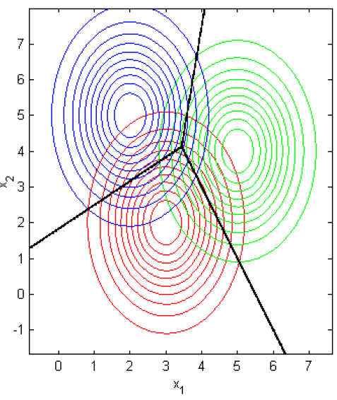
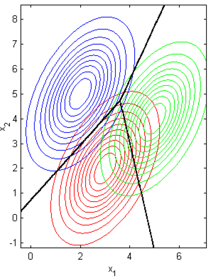
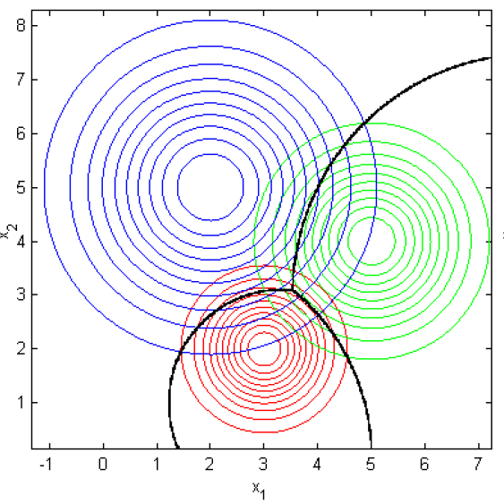
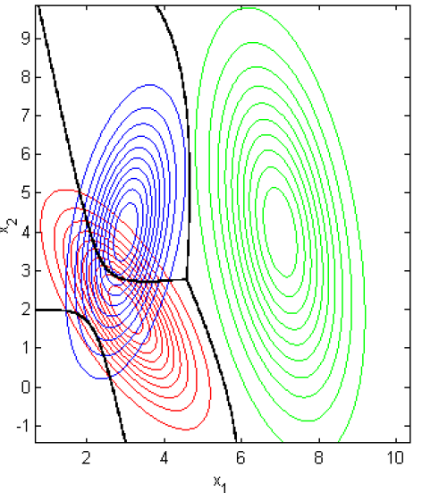

## Mathematical background

The exact knowledge of prior probabilities and conditional probabilities are generally hard to evaluate thus a parametric approach is often needed.
A parametric approach aim to create reasonable hypothesis about the distribution under analysis and its fundamental parameters (e.g mean, variance, ...).
In the following discussion, we are going to focus only on normal distributions for mathematical convenience but the results could be easily generalized.

Given the multi-dimensional form of Gauss distribution:

$$
G(\mathbf{x}|\mu, \Sigma) = \frac{1}{(2\pi)^{d/2}\cdot\left|\Sigma\right|^{1/2}}\cdot exp\left[-\frac{1}{2}(\mathbf{x}-\mathbf{\mu})^T\Sigma^{-1}(\mathbf{x}-\mathbf{\mu})\right]
$$

where $$\mathbf{x}$$ is a $$d$$-dimensional column vector, $$\mathbf{\mu}$$ is the mean vector of the distribution, $$\Sigma$$ is the covariance matrix ($$d\times d$$) and $$|\Sigma|$$ and $$\Sigma^{-1}$$ the determinant and the inverse of $$\Sigma$$, respectively, we can notice the quadratic dependence of $$G$$ depends by $$\mathbf{x}$$,

$$
\Delta^2 = (\mathbf{x}-\mu)^T\Sigma^{-1}(\mathbf{x}-\mu)
$$

where the exponent ($$\Delta^2$$) is called *Mahalanobis distance* of vector $$\mathbf{x}$$ from its mean.
This distance can be reduced to the Euclidean one when the covariance matrix is the identity matrix ($$\mathbf{I}$$).

The covariance matrix is always symmetric and positive semi-definite by definition (useful information for the next algorithmic strategies) it is invertible.
If the covariance matrix has only diagonal terms the multidimensional distribution can be expressed as the simple product of `d` mono-dimensional normal distributions.
In this case the main axes are parallel to the Cartesian axes.

Starting from a multi-variate Gaussian distribution [^1], the Bayesian rule for classification problems can be rewritten as:

$$
g_i(\mathbf{x}) = P(w_i|\mathbf{x}) = \frac{p(\mathbf{x}|w_i)P(w_i)}{p(\mathbf{x})} = \frac{1}{(2\pi)^{d/2}\cdot\left|\Sigma_i\right|^{1/2}}\cdot exp\left[-\frac{1}{2}(\mathbf{x}-\mathbf{\mu_i})^T{\Sigma_i}^{-1}(\mathbf{x}-\mathbf{\mu_i})\right] \frac{P(w_i)}{p(\mathbf{x})}
$$

where, removing constant terms ($$\pi$$ factors and the absolute probability density $$p(\mathbf{x}) = \sum_{i=1}^s p(\mathbf{x}|w_i)\cdot P(w_i)$$) and using the monotonicity of the function, we can extract the logarithmic relation:

$$
g_i(\mathbf{x}) = -\frac{1}{2}(\mathbf{x}-\mu_i)^T{\Sigma_i}^{-1}(\mathbf{x}-\mu_i) -\frac{1}{2}\log\left|\Sigma_i\right|+\log P(w_i)
$$

which is called *Quadratic Discriminant function*.

The dependency by the covariance matrix allows 5 different cases:

* **$$\Sigma_i=\sigma^2I$$ - DiagLinear Classifier**

  

  This is the case in which features are completely independent, i.e they have equal variances for each class.
  This hypothesis allows us to simplify the discriminant function as:

  $$
  g_i(\mathbf{x})=-\frac{1}{2\sigma^2}(\mathbf{x^Tx}-2{\mu_i}^T\mathbf{x} + {\mu_i}^T\mu_i) + \log P(w_i)
  $$

  and removing all the constant $$\mathbf{x^Tx}$$ terms for each class

  $$
  g_i(\mathbf{x}) = -\frac{1}{2\sigma^2}(-2{\mu_i}^T\mathbf{x}+{\mu_i}^T\mu_i)+\log P(w_i) = \mathbf{w_i}^T\mathbf{x}+\mathbf{w_0}
  $$

  These simplifications create a linear discriminant function and the separation surfaces between classes are hyper-planes ($$g_i(\mathbf{x})=g_j(\mathbf{x})$$).

  With equal prior probability the function can be rewritten as

  $$
  g_i(\mathbf{x}) = -\frac{1}{2\sigma^2}(\mathbf{x}-\mu_i)^T(\mathbf{x}-\mu_i)
  $$

  which is called *nearest mean classifier* and the equal-probability surfaces are hyper-spheres.

* **$$\Sigma_i = \Sigma$$ (diagonal matrix) - Linear Classifier**

  

  In this case the classes have same covariances but each feature has its own different variance.
  After the $$\Sigma$$ substitution in the equation, we obtain

  $$
  g_i(\mathbf{x}) = -\frac{1}{2}\sum_{k=1}^{s}\frac{(\mathbf{x_k}-\mu_{i,k})^2}{\sigma_k}^2-\frac{1}{2}\log\prod_{k=1}^{s}{\sigma_k}^2+\log P(w_i)
  $$

  where we can remove constant $$\mathbf{x_k}^2$$ terms (equal for each class) and obtain another time a linear discriminant function and discriminant surfaces given by hyper-planes and equal-probability boundaries given by hyper-ellipsoids.
  We remark that the only difference from the previous case is the normalization factor of each axis that in this case is given by its variance.

* **$$\Sigma_i = \Sigma$$ (non-diagonal matrix) - Mahalanobis Classifier**

  

  In this case we assume that each class has the same covariance matrix but they are non-diagonal ones.
  The discriminant function becomes

  $$
  g_i(\mathbf{x}) = -\frac{1}{2}(\mathbf{x}-\mu_i)^T{\Sigma}^{-1}(\mathbf{x}-\mu_i) -\frac{1}{2}\log\left|\Sigma\right|+\log P(w_i)
  $$

  where we can remove the $$\log\left|\Sigma\right|$$ term because it is constant for all the classes and we can assume equal prior probability.
  In this case we obtain

  $$
  g_i(\mathbf{x}) = -\frac{1}{2}(\mathbf{x}-\mu_i)^T{\Sigma}^{-1}(\mathbf{x}-\mu_i)
  $$

  where the quadratic term is the above told *Mahalanobis distance*, i.e a normalization of the distance according to the inverse of the covariance matrix.
  We can prove that expanding the scalar product and removing the constant $$\mathbf{x^T\Sigma^{-1}x}$$ term, we still obtain a linear discriminant function with the same properties of the previous case.
  In this case the hyper-ellipsoids have axes aligned according to the eigenvectors of the $$\Sigma$$ matrix.

* **$$\Sigma_i = {\sigma_i}^2I$$ - DiagQuadratic Classifier**

  

  In this case we have a different covariance matrix for each class but they are all proportional to the identity matrix, i.e diagonal matrix.
  The discriminant function in this case becomes

  $$
  g_i(\mathbf{x}) = -\frac{1}{2}(\mathbf{x}-\mu_i)^T{\sigma_i}^{-2}(\mathbf{x}-\mu_i) -\frac{1}{2}s\log\left|{\sigma_i}^2\right|+\log P(w_i)
  $$

  where this expression can be further reduced obtaining a quadratic discriminant function.
  In this case the equal-probability boundaries are hyper-spheres aligned to the feature axes.

* **$$\Sigma_i \neq\Sigma_j$$ (general case) - Quadratic Classifier**

  

  Starting from the more general discriminant function we can relabel the variables and highlight its quadratic form as

  $$
  g_i(\mathbf{x}) = \mathbf{x^TW_{2,i}x}+\mathbf{w_{1,i}^Tx} + \mathbf{w_{0,i}} \quad \mbox{with}\quad \left\{\begin{array}{l} \mathbf{W_{2,i}}=-\frac{1}{2}{\Sigma_i}^{-1}\\ \mathbf{w_{1,i}}={\Sigma_i}^{-1}\mu_i \\ \mathbf{w_{0,i}}=-\frac{1}{2}{\mu_i}^T{\Sigma_i}^{-1}\mu_i-\frac{1}{2}\log\left|\Sigma_i\right|+\log P(w_i) \\ \end{array}\right.
  $$

  In this case each class has its own covariance matrix $$\Sigma_i$$ and the equal-probability boundaries are hyper-ellipsoids oriented to the eigenvectors of the covariance matrix of each class.

The Guassian distribution hypothesis of data should be tested before using this classifiers.
It can be evaluated using statistical tests as [*Malkovich-Afifi*](https://www.jstor.org/stable/2284163?seq=1#page_scan_tab_contents) based on [*Kolmogorov-Smirnov*](https://en.wikipedia.org/wiki/Kolmogorov–Smirnov_test) index or using the empirical visualization of the data points.

[^1]: In Machine Learning it will correspond to the conditional probability density.

[**next >>**](./Numerical.md)
