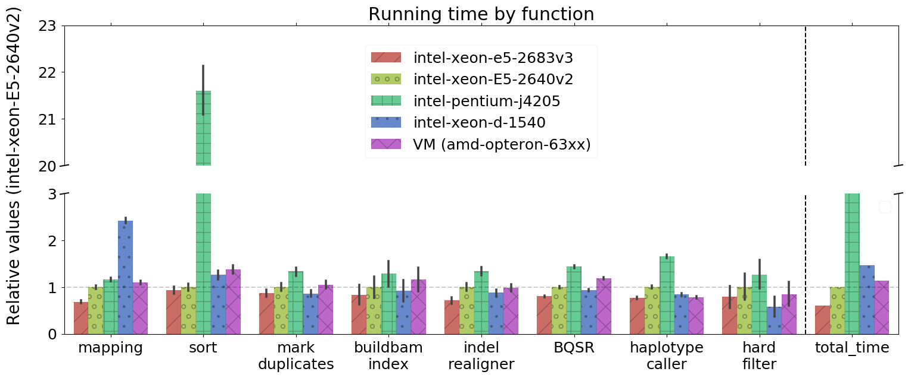
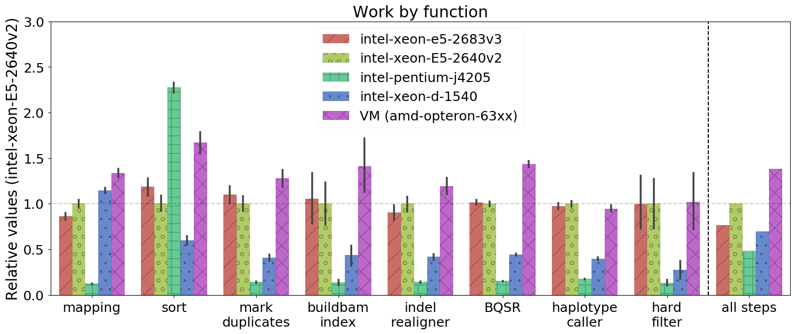

## Results

Memory occupation is one of the major drawbacks of the bioinformatics pipelines, and one of the greater limits to the possibility of parallel computation of multiple subjects at the same time.

As it can be seen in Fig. [1](../../../../img/memory_per_function.png), the memory occupation is comprised between 10% and 30% on all the nodes.
This is due to the default behavior of the GATK libraries to reserve a fixed percentage of the total memory of the node.
The authors could not find any solution to prevent this behavior from happening.
As it can be noticed, in the node with the greatest amount of total memory (both Xeon E5 and the virtual machine) the requested memory is approximately stable, as is always sufficient for the required task.
The memory allocation is less stable in the nodes with a limited memory (Xeon D and Pentium J), as GATK might requires more memory than what initially allocated to perform the calculation.
The exception to this behavior is the *mapping* step, that uses a fixed amount of memory independently from the available one (between 5 and 7 GB).
This is due to the necessity of loading the whole human reference genome (version hg19GRCh37) to align each individual read to it.
All the other steps do not require the human reference genome but can work on the individual reads, allowing greater flexibility in memory allocation.

As can be seen in Fig. [2](../../../../img/time_performances.png) and Fig. [3](../../../../img/energy_and_cost.png), this increase of memory consumption does not correspond to a proportional improvement of the time elapsed in the computation.

The elapsed time for each step and for the whole pipeline can be seen in Fig. [2](../../../../img/time_performances.png).
It can be seen that there is a non consistent trend in the behavior of the different environments.
Aside from the most extreme low power machine, the pentium J, the elapsed times are on average higher for the low power and slightly higher for the cloud node, but the time for the individual rule can vary.
In the sorting step, Pentium J is 20 times slower than the reference.
This is probably due to the limited cache and memory size of the pentium J, that are both important factors determining the execution time of a sorting algorithm and are both at least four to six times smaller than the other machines.
The HPC machine, the Xeon E52683, is consistently faster than the reference node.

The energy consumption per step can be seen in Fig. [3](../../../../img/energy_and_cost.png).
The low power machines are consistently less than half the baseline consumption.
Even considering the peak of consumption due to the long time required to perform the sorting, the most efficient low power machine, the pentium J, consumes 40% of the reference, and the Xeon D consumes 60% of the reference.
The HPC machine, the Xeon E52683, have consumption close to the low power nodes, balancing out the higher energy consumption with a faster execution speed.
The virtual machine has the highest consumption despite the fact that the execution time of the whole pipeline is comparable to the reference due to the high TDP compared to its execution time.

[**next >>**](./Conclusion.md)

