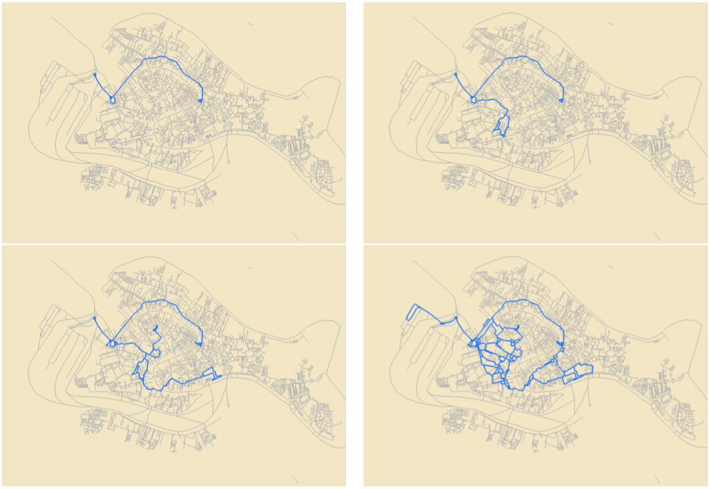

## Mobility paths reconstruction on the road network

The procedure of mobility path reconstruction considers separately the land mobility and the water mobility since the two mobility networks have different features, so that it is necessary to check carefully the transitions from one network to the other.
To create a mobility path, we connect two successive points left by the same device using a best path algorithm on the road network with a check on the estimated travel speed to avoid unphysical situations and discarding the paths whose velocity is clearly not consistent with
the typical pedestrian velocity (or ferryboat velocity).
To end a land path and to start a water path, we require that at least two successive points of the same device are attributed to a ferryboat line by the localization algorithm.
In the case of a single point on a ferryboat line, we force the localization of this point on the nearest road on the land.

The reconstruction of the mobility paths also allows to study how people perform their mobility on the road network.
We consider the problem of determining the most used subnetwork of the Venice road network.
The existence of mobility subnetworks could be the consequence of the peculiarity of Venice road network, where it is quite easy to get lost
if you do not have a map.
Therefore people with a limited knowledge of the road network move according to paths suggested by Internet sites or following the signs on the roads.
To point out a mobility subnetwork we rank the roads of Venice according to a weight proportional to the number of mobility paths passing through each road.
Thus We define a relevant subnetwork as a connected subnetwork that explains a considerable fraction of the observed mobility.
In this case each road (identified by two nodes in the poly-line format) represents the link of our weighted graph and we can apply the DNetPRO technique shown in the implementation section to identify the network core with only closed paths [^1].

Starting from the previously evaluated daily flows for each road, we order in a decreasing way the roads according to the observed
flows.
The DNetPRO algorithm scrolls down the list adding the road to a temporary list.
At every step the "pruning process" starts on the selected roads cutting the isolated roads in order to get a connected subnetwork [^2].
Therefore the number of nodes of the subnetwork increases in a discontinuous way, when the adding of a new road in the list allows to
connect several previously selected roads.
After several parametric scans, we found that the best result for our purposes is achieved by choosing about the 10% of the nodes in the whole Venice road network.
In Fig. [1](../../../../img/venice_step.PNG) we show four consecutive selected subnetworks in the case of Carnival dataset to illustrate how the algorithm operates.

Using the DNetPRO algorithm we are able to extract a subnetwork which explains the 64% of the observed mobility using 13% of the total road network length for the case of the Carnival dataset and 15% of the total length in the case of the *Festa del Redentore* dataset.

The selected road subnetworks are plotted in the Fig. [2](../../../../img/venice_result.PNG) for both the datasets.
As a matter of fact, many of the highlighted paths are also suggested by Internet sites.
However, we remark some differences that can be related by the different nature of the considered events.
During the Carnival of Venice the mobility seems to highlight three main directions connecting the railway station and the *Piazzale Roma* (top-left in the map), which are the main access points to the Venice historical centre, with the area around San Marco square, where many activities where planned during 26/02/2017.
In the case of the *Festa del Redentore* the structure is more complex due to the appearance of several paths connecting the station and *Piazzale Roma* with the *Dorsoduro* district in front of the *Giudecca* island.

This geometrical structure could have a double explanation: on one hand the *Festa del Redentore* introduces an attractive area near the *Giudecca* island, where the fireworks take place in the evening; on the other hand the *Festa del Redentore* is a festivity very much felt by the local population, that knows the Venice road network and performs alternative paths.

On these subnetwork we also map the mobility of Italians and foreigns separately.
The results of this application are deeply discussed in the paper.

[^1]: Pendant nodes are unphysical solutions in our model since we are interested on the pedestrian mobility paths that bring people from one location to an other.

[^2]: Since we are interested on the largest connected component the *merging* parameter is off.

[**next >>**](../BlendNet/README.md)
