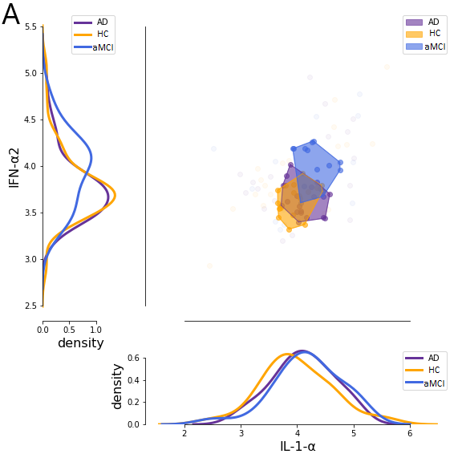
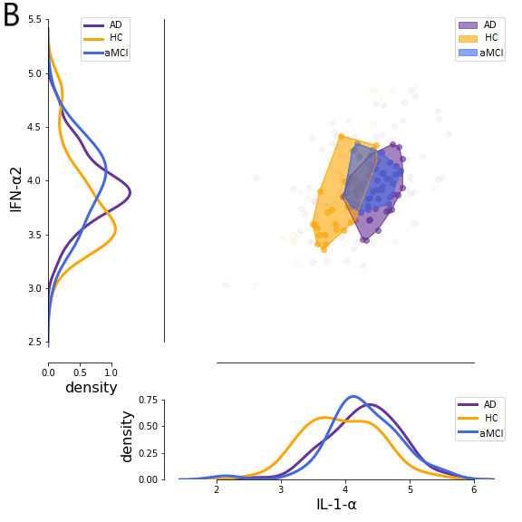

## Results

The best signature identified to discriminate between CTL and AD subjects is composed of three cytokines, IFN$$\alpha$$2, TNF$$\alpha$$, and IL-1$$\alpha$$.
Its total accuracy on the CTL-AD test set is 65.27% (with 61% CTL and 66% AD correctly classified).
The sensitivity/specificity values for classification is reported in the Table.

|| **Accuracy** AD vs. CTL| **Sensitivity** AD | **Specificity** CTL || **Prediction** MCI as non-CTL | **Sensitivity** MCI | **Specificity** CTL |
|:-----:|:------------:|:---------------:|:---------------:|:-:| :-------------:|:---------------:|:---------------:|
| Men   |    16/25     |    8/12         |    8/13         |   |      15/26     |    15/26        |      24/36      |
|       |   (64.00%)   |  (66.67%)       |   (61.54%)      |   |     (57.69%)   |   (57.69%)      |     (66.67%)    |
| Women |    33/48     |   27/38         |    6/10         |   |      41/47     |    41/47        |      23/51      |
|       |   (68.75%)   |  (71.05%)       |   (60.00%)      |   |     (87.23%)   |   (87.23%)      |     (45.09%)    |
| Total |    47/72     |   36/54         |   11/18         |   |      62/73     |    62/73        |      36/87      |
|       |   (65.24%)   |  (66.66%)       |   (61.11%)      |   |     (84.93%)   |   (84.93%)      |     (41.38%)    |

Applying this signature to classify MCI vs CTL samples, it correctly predicted 84.93% of MCI as "non-CTL".
Two cytokines from the signature, IFN$$\alpha$$2 and IL-1$$\alpha$$, showed a significant difference between groups also at a single cytokine level in previous analyses.
We plotted them as a representative in all population and stratified the scatter plots by sex (ref Figure A, B).
The CTL group resulted better separated from MCI and AD in women as compared with men.
The trajectory of the subject groups moves from CLT to AD, and interestingly the identified signature is able to differentiate MCI from CLT better than from AD.
This is a promising result since it seems more useful to recognize MCI from CLT than full-blown AD from CLT.
Probably the poor sensibility in detecting AD could be linked to the disease evolution that makes nebulous and vague the cytokine pattern in the brain of these patients, as confirmed from several studies that found both up-regulation and down-regulation of many cytokines in AD cerebral samples.
This fact could be more accentuated in our population of old age subjects in which markers of aging are often mixed with those of dementia.

In this study we show that: 1) an easy to get cytokines signature composed of three molecules - IFN$$\alpha$$2, TNF$$\alpha$$, and IL-1$$\alpha$$ - is able to discriminate the studied groups;  2) the combination of IFN$$\alpha$$2 and IL-1$$\alpha$$ able to distinguish CTL from  aMCI and AD better in women than in men.
Sex (referred to biological differences) and gender (psychosocial and cultural differences) affect human brain biology throughout individual lifespans, affecting male and female cognitive functions differently.
Epidemiological studies show that women have a higher risk of AD as well as a higher dementia prevalence, particularly in the old age, as compared with men.

In conclusion, the identified cytokinome signature shows a good accuracy in differentiating MCI from CTL, especially in female.
Understanding sex differences will help to define individualized preventive and treatment interventions for AD.

[**next >>**](../Bovine/README.md)
