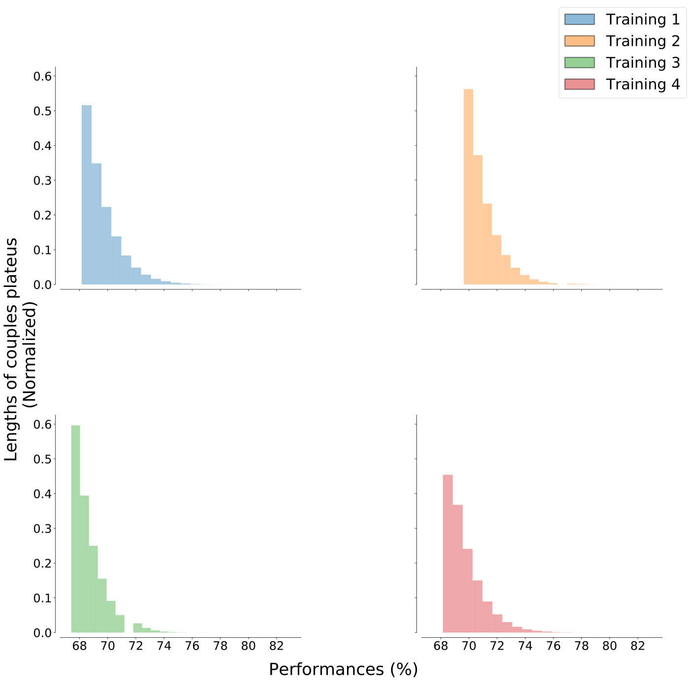

## Couple ranking

Since the number of variable pairs is typically very large (e.g. `10^8` pairs with gene expression microarrays containing about `10^4` probes), many of them may achieve the same performance, since the possible values are integer number typically in a limited range (corresponding to the number of available samples, `10^2-10^3` in many cases).
Therefore, the pair ranking is characterized by multiple "plateaus" (Fig. [1](../../../../img/lengths.svg)(a)),  and the selection of variable pairs, based on a hard thresholding procedure, is highly influenced by this behavior.
Monitoring this trend we can notice that only a few number of pairs belong to the first performance chunks and, while the performances decrease, multiple pairs (and features) appear, as it can be seen in Fig. [1](../../../../img/lengths.svg)(a).

This kind of trend highlights the difficulty on finding informative features inside the huge noise of other variables and it gives us a constrain in the developing of a realistic biological toy model (ref. previous sections).
Moreover, it confirms that a putative signature could be made by only a few central genes, at least weakly connected with other noisy nodes.

, where `r` is the rank value, `M` its maximum value, `A` a normalization constant and (`a`, `b`) two fitting exponents.](../../../../img/plateaus.svg)

As in other cases of ranked values [rankfit](https://journals.plos.org/plosone/article?id=10.1371/journal.pone.0004791), we can fit these ranking distributions with a combination of power-law functions, obtaining a good agreement with experimental points (Fig. [1](../../../../img/plateaus.svg)(b)).

We also observed that *star*-networks frequently appear with one variable highly connected to many others which are only connected with it.
This happens when a variable has a strong discriminating power, to which other possibly less relevant variables get linked for noisy fluctuations.

As stated before, we suggest that these variables (pendant nodes in the *star*-network) can be removed from the signature without significantly affecting its performance.
The procedure can be applied for one single step (in order to remove pending nodes from a star configuration) or it can be applied recursively, until the signature becomes constituted only by the 2-core network (i.e. with all nodes having degree $$\geq2$$).
Empirical analysis performed on real data has shown that the removal of these variables does not affect significantly the signature performance and in the meanwhile it allows a significant reduction of its dimensionality.
Since there is no clear theoretical explanation of this behavior, we suggest to introduce this step only optionally, since it is not easy to quantify the risk of loosing relevant information from the removed variables.
The underlying idea is that the more connected are the nodes, the more the variables in the signature "work well" together, a plausible hypothesis given by the linear sample separation surface provided by the Discriminant classifier.
Moreover, the network structure of the signature suggests further considerations about the relevance of a variable as a function of its role in the network (e.g. node centrality such as degree or betweenness centrality).

[**next >>**](./Overlap.md)
