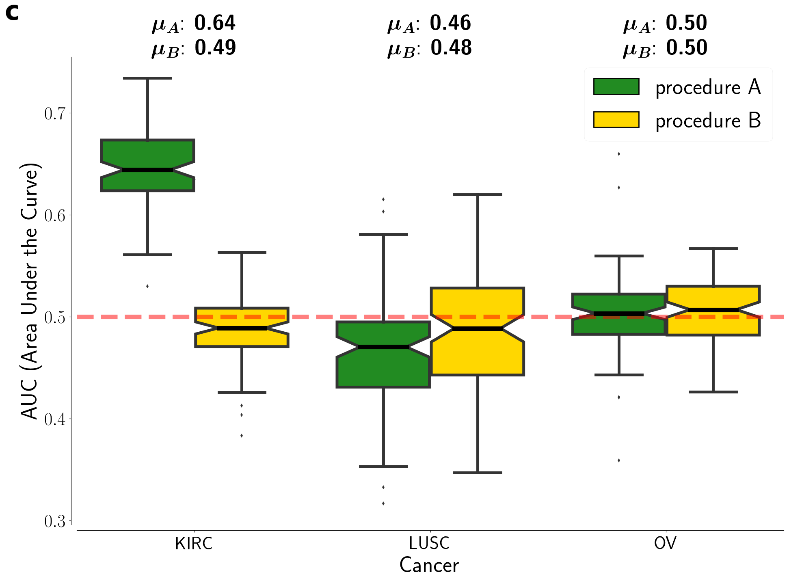

## miRNA and RPPA data

The same analysis pipeline presented in the paper about gene expression data from the Synapse dataset is applied in this Section also to the miRNA and RPPA datasets, with the results presented in Fig. [1](../../../../img/RPPA_boxplot.png) and Fig. [2](../../../../img/miRNA_boxplot.png).

|  | 
|:---:|:----:|
| . Distributions of AUC values for the tumor datasets. Green boxplots: results using procedure `A` as described in Fig.[-1](../../../img/dnet_pipe.pdf); yellow boxplots: results obtained using procedure `B`.](../../../../img/miRNA_boxplot.png) | |
|:---:|:----:|

The results obtained on the miRNA dataset (Figure (a, b)) are comparable to the reference, while for the RPPA dataset only the LUSC tumor shows AUC values comparable with the others.
Moving from the procedure `A` to the procedure `B`, i.e. adding a second cross-validation step, the RPPA performances drastically decrease for the KIRC and OV, while their remain quite stable for the LUSC dataset.
The same behavior is shown in the miRNA datasets in which however both performances are still comparable or better (KIRC, GBM, LUSC) than the reference ones.

These results are not so good as the mRNA ones and this behavior highlights some limitations of the algorithm.
In the mRNA dataset we hypothesized a monotonic behavior of genes (up- or down-regulation of gene expression level) and this model is very likely.
An analogous model for the miRNA data has not yet been demonstrated.
We can guess that the low performances obtained on the RPPA were related to the intrinsic nature of these data and to the experimental difficulties about data interpretation.
We have to consider also the technique used to acquire these kind of data which is different from the mRNA one: different experiments can introduce different noise sources which can affect our model performances.

[**next >>**](./Ranking.md)
