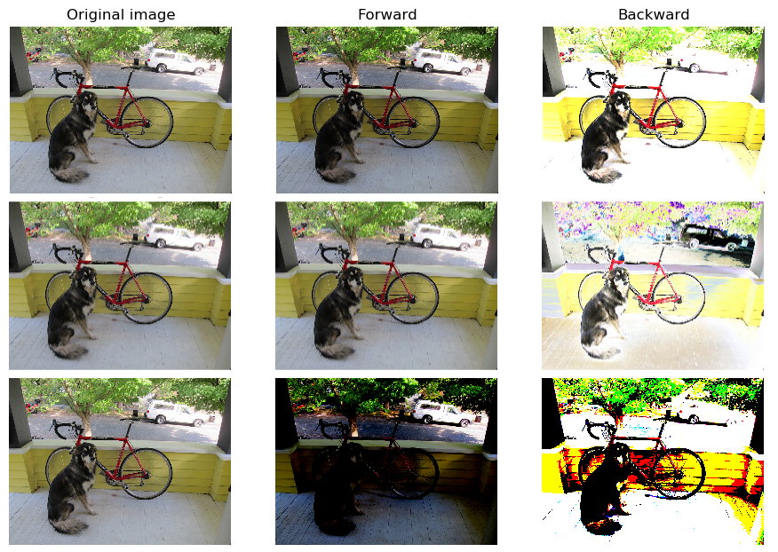

## Activation Functions

Activation functions (or transfer functions) are linear or non linear equations which process the output of a Neural Network neuron and bound it into a limit range of values (commonly $$\in[0, 1]$$ or $$\in[-1, 1]$$).
The output of a simple neuron [^1] can be computed as dot product of the input and neuron weights (see previous section); in this case the output values range from $$-inf$$ to $$+inf$$ and they are equivalent to a simple linear function.
Linear functions are very simple to trait but they are limited in their complexity and thus in their learning power.
Neural Networks without activation functions are just simple linear regression model (see the fully connected Neural Network properties in the previous section).
Neural Networks are considered as *Universal Function Approximators* so the introduction of non-linearity allows them to model a wide range of functions and to learn more complex relations in pattern data.
From a biological point-of-view the activation functions model the on/off state of a neuron in the output decision process.

Many activation functions have been proposed during the years and each one has its characteristics, but not an appropriated application field.
The best activation function to use in a given situation (to a particular problem) is still an open question.
Each one has its pros and cons in some situations, so each Neural Network library implements a wide range of them and it leaves to the user to perform his own tests.
In the following Table we show the list of activation functions implemented in our `NumPyNet` and `Byron` libraries, with mathematical formulation and corresponding derivative (ref. [`activations.py`](https://github.com/Nico-Curti/NumPyNet/blob/master/NumPyNet/activations.py) for the code implementation).
An important feature of any activation function, in fact, is that it should be differentiable since the main procedure of model optimization implies the back-propagation of the error gradients.

| **Name** | **Equation** | **Derivative** |
|:--------:|:------------:|:--------------:|
|Linear   |  $$f(x) = x$$                              |  $$f'(x) = 1$$ |
|Logistic |  $$f(x) = \frac{1}{1 + \exp(-x)}$$         |  $$f'(x) = (1 - f(x)) * f(x)$$ |
|Loggy    |  $$f(x) = \frac{2}{1 + \exp(-x)} - 1$$     |  $$f'(x) = 2 * (1 - \frac{f(x) + 1}{2}) * \frac{f(x) + 1}{2} $$ |
|Relu     |  $$f(x) = \max(0, x)$$                     |  $$f'(x) = \left\{\begin{array}{rlr} 1 & \mbox{if} & f(x) > 0 \\ 0 & \mbox{if} & f(x) \leq 0 \end{array}\right.$$  |
|Elu      |  $$f(x) = \max(\exp(x) - 1, x)$$           |  $$f'(x) = \left\{\begin{array}{rlr} 1 & \mbox{if} & f(x) \geq 0 \\ f(x) + 1 & \mbox{if} & f(x) < 0 \end{array}\right.$$ |
|Relie    |  $$f(x) = \max(x * 1e-2, x) $$             |  $$f'(x) = \left\{\begin{array}{rlr} 1 & \mbox{if} & f(x) > 0 \\ 1e-2 & \mbox{if} & f(x) \leq 0 \end{array}\right.$$ |
|Ramp     |  $$f(x) = \left\{\begin{array}{rlr} x^2 + 0.1 * x^2 &  \mbox{if} & x > 0 \\ 0 & \mbox{if} & x \leq 0 \end{array}\right.$$ |  $$f'(x) = \left\{\begin{array}{rlr} f(x) + 1 & \mbox{if} & f(x) > 0 \\ f(x) & \mbox{if} & f(x) \leq 0 \end{array}\right.$$ |
|Tanh     |  $$f(x) = \tanh(x)$$                       |  $$f'(x) = 1 - f(x)^2$$  |
|Plse     |  $$f(x) = \left\{\begin{array}{rlr} (x + 4) * 1e-2     & \mbox{if} & x < -4 \\ (x - 4) * 1e-2 + 1 & \mbox{if} & x > 4 \\ x * 0.125 + 5 & \mbox{if} & -4 \leq x \leq 4\end{array}\right.$$ |  $$f'(x) = \left\{\begin{array}{rlr} 1e-2  & \mbox{if } & f(x) < 0 \mbox{ or } f(x) > 1 \\  0.125 & \mbox{if } & 0 \leq f(x) \leq 1 \end{array}\right.$$ |
|Leaky    |  $$f(x) = \left\{\begin{array}{rlr} x * C &  \mbox{if} & x \leq 0 \\ x     &  \mbox{if} & x > 0\end{array}\right.$$ |  $$f'(x) = \left\{\begin{array}{rlr} 1   & \mbox{if} & f(x) > 0    \\ C   & \mbox{if} & f(x) \leq 0 \end{array}\right.$$           |
|HardTan  |  $$f(x) = \left\{\begin{array}{rlr} -1 & \mbox{if} &     x < -1 \\ +1 & \mbox{if} &     x > 1  \\  x & \mbox{if} & -1 \leq x \leq 1\end{array}\right.$$ |  $$f'(x) = \left\{\begin{array}{rlr} 0 & \mbox{if} & f(x) < -1 \mbox{ or } f(x) > 1 \\ 1 & \mbox{if} & -1 \leq f(x) \leq 1\end{array}\right.$$                            |
|LhTan    |  $$f(x) = \left\{\begin{array}{rlr} x * 1e-3           & \mbox{if} &     x < 0  \\ (x - 1) * 1e-3 + 1 & \mbox{if} &     x > 1  \\  x                 & \mbox{if} & 0 \leq x \leq 1\end{array}\right.$$ |  $$f'(x) = \left\{\begin{array}{rlr}  1e-3           & \mbox{if} & f(x) < 0 \mbox{ or } f(x) > 1 \\  1              & \mbox{if} & 0 \leq f(x) \leq 1 \end{array}\right.$$                                  |
|Selu     |  $$f(x) =\left\{\begin{array}{rlr}  1.0507 * 1.6732 * (e^x - 1) & \mbox{if} &    x < 0  \\  x * 1.0507                  & \mbox{if} &    x \geq 0 \end{array}\right.$$ |  $$f'(x) = \left\{\begin{array}{rlr}  f(x) * 1e-3           & \mbox{if} & f(x) 0    \\  (f(x) - 1) * 1e-3 + 1 & \mbox{if} & f(x) > 1  \\  \end{array}\right.$$                           |
|SoftPlus |  $$f(x) = log(1 + e^{x})$$                 |  $$f'(x) = \frac{\exp(f(x)}){1 + e^{f(x)}}$$ |
|SoftSign |  $$f(x) = \frac{x}{|x| + 1}$$              |  $$f'(x) = \frac{1}{(|f(x)| + 1)^{2}}$$ |
|Elliot   |  $$f(x) = \frac{\frac{1}{2} * S * x}{1 + |x + S|} + \frac{1}{2}$$ |  $$f'(x) = \frac{\frac{1}{2} * S}{(1 + |f(x) + S|)^{2}} $$ |
|SymmElliot |  $$f(x) = \frac{S * x}{1 + |x * S|}$$    |  $$f'(x) = \frac{S}{(1 + |f(x) * S|)^{2}}$$ |

As can be seen in the table it is easier to compute the activation function derivative as function of it.
This is a (well known) important type of optimization in computation term, since it reduces the number of operations and it allows to apply the backward gradient directly.

To better understand the effects of activation functions, we can apply these functions on a test image.
This can be easy done using the example scripts inserted inside our `NumPyNet` library.
In Fig. [1](../../../../img/activations_layer.png) the effects of the previously described functions are reported on a test image.
For each function we show the output of the activation function and its gradient.
For visualization purposes the image values have been rescaled $$\in[-1, 1]$$ before the input to the functions.

From the results given in Figure we can better appreciate the differences between the several mathematical formulas: a simple Logistic function does not produce evident effects on the test image while a Relu activation tends to overshadow the image pixels.
This feature of the Relu activation function is very useful in Neural Network model and is also determines important theoretical consequences, which led it to be one of the most prominent solution for many Neural Network models.

The ReLU (Rectified Linear Unit) activation function is, in fact, the most used into the modern Neural Networks models.
Its diffusion is imputed to its numerical efficiency and to the benefits it brings [[Glorot2011Relu](http://proceedings.mlr.press/v15/glorot11a.html)]:

* Information disentangling: the main purpose of a Neural Network model is to tune a discriminant function able to associate a set of input to a prior-known output classes. A dense information representation is considered *entangled* because small differences in input highly modify the data representation inside the network. On the other hand, a sparse representation tends to guarantee a conservation of the learning features.

* Information representation: different inputs can lead different quantities of useful information. The possibility to have null values in output (ref Table) allows a better representation of the dimensions inside the network.

* Sparsity: sparsity representation of data is exponentially efficient in comparison to dense one, where the exponential power is given by the number of no-null features [[Glorot2011Relu](http://proceedings.mlr.press/v15/glorot11a.html)].

* Vanish gradient reduction: if the activation output is positive we have a no-bound gradient value.

In the next sections we will discuss about different kind of Neural Network models and in all of them we choose to use Relu activation function in the major part of the layers.

[^1]: We assume for simplicity a fully connected Neural Network neuron.

[**next >>**](./Convolutional.md)
