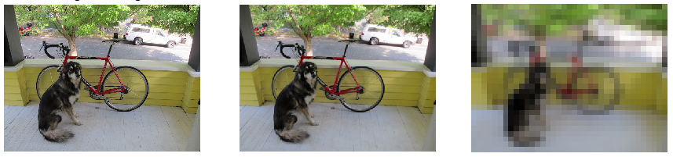

## Pooling function

Output Neural Network feature maps often suffer of sensitivity on feature location in the input.
One possible approach to overcome this problem is to down sample the feature maps making the resulting feature map more robust to changes in the position.
Pooling functions perform this kind of down sample and they reduce the spatial dimension (but not depth) of the input.
Their use represents an important computational performance improver tool (less feature, less operations) and a useful dimensionality reduction method.
The reduction of feature quantity can also prevent over-fitting problems and it improves the classification performances.

Pooling layers are intrinsically related to Convolutional layers.
The analogy lives in the filter mapping procedure which produces the output in both methods.
While in the Convolutional layer we map a filter over the input signal and we apply a multiplication of the layer weights and the signal values, in the pooling layer we simply change the filter function keeping the same filter mapping procedure (see section ([convolutional](../Convolutional.md)) for more informations).
The input parameters of the method are the same of the Convolutional one: the input dimensions, the kernel size and (optional) the stride value.

The most common pooling layers are the Average Pool and the Maximum Pool.
The Average Pool layer performs a down sampling on the batch of images.
It slides a 2D kernel of arbitrary size over the image and the output is the mean value of the pixels inside the kernel.
In the following Figure are shown some results obtained by performing an average pool with different kernel sizes.
Also in this case this test was obtained using our NumPyNet library.



If in the Convolutional layers a key role was played by the matrix product, in the Pooling layers we have to carefully manage the mapping operations to obtain optimal results.
In particular we would to show the efficient implementation provided into NumPyNet.

In the previous sections we introduced the `im2col` algorithm which is an efficient method to re-organize the input data.
The same algorithm can also be applied for Pooling layers and thus evaluate the Pooling function (avg, max, etc.) on each row of the re-arranged matrix.
The implementation of the `im2col` algorithm in Python requires the evaluation of multiple indexes using complex formulas.
Since the NumPyNet library was founded on the Numpy package we can provide an alternative implementation using the `view` functionality of the library.
A `view` of a given array is simply another way of viewing its data: technically that means that the data of both objects is shared and thus no copies are created.
In particular we can use the deeper functions of the Numpy package to create a re-organization of our data according to the desired output [^1].
In the following code we show our implementation of the Average Pooling layer:

```python
import numpy as np

class Avgpool_layer(object):

  def __init__(self, size=(3, 3), stride=(2, 2)):

    self.size = size
    self.stride = stride
    self.batch, self.w, self.h, self.c = (0, 0, 0, 0)
    self.output, self.delta = (None, None)

  def _asStride(self, input, size, stride):

    batch_stride, s0, s1 = input.strides[:3]
    batch,        w,  h  = input.shape[:3]
    kx, ky     = size
    st1, st2   = stride

    # Shape of the final view
    view_shape = (batch, 1 + (w - kx)//st1, 1 + (h - ky)//st2) + input.shape[3:] + (kx, ky)

    # strides of the final view
    strides = (batch_stride, st1 * s0, st2 * s1) + input.strides[3:] + (s0, s1)

    subs = np.lib.stride_tricks.as_strided(input, view_shape, strides=strides)
    # returns a view with shape = (batch, out_w, out_h, out_c, kx, ky)
    return subs

  def forward(self, input):

    self.batch, self.w, self.h, self.c = input.shape
    kx, ky = self.size
    sx, sy = self.stride

    input = input[:, : (self.w - kx) // sx*sx + kx, : (self.h - ky) // sy*sy + ky, ...]
    # 'view' is the strided input image, shape = (batch, out_w, out_h, out_c, kx, ky)
    view = self._asStride(input, self.size, self.stride)

    # Mean of every sub matrix, computed without considering the pad(np.nan)
    self.output = np.nanmean(view, axis=(4, 5))

```

A key role in this implementation is played by the `_asStride` function: it returns a view of the original array in which all the masks are organized into a single list.
Using this data re-arrangement we can easily compute the desired pooling function (average in this example) according to the appropriated axes.
We would stress that no copies are produced during this computation and thus we can obtain a faster execution than other possible implementations (e.g `im2col`).


[^1]: The same technique was also used for the implementation of the Convolutional layer in the NumPyNet library.

[**next >>**](./BatchNorm)
