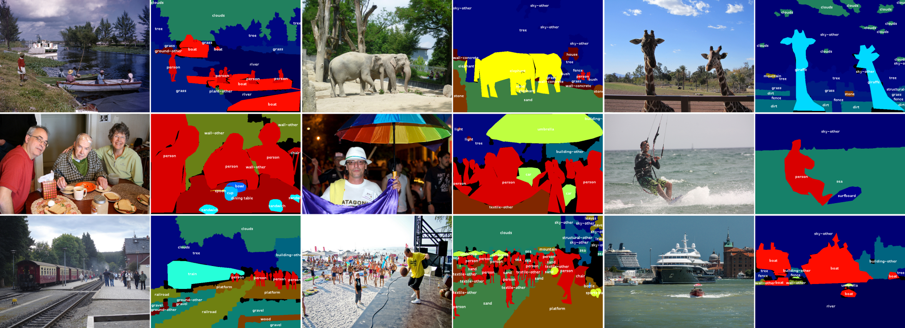

## COCO dataset

The first issue to take into account when we want to train an object detection model is certainly to provide a good training set.
The dataset has to include multiple and different prospective of the searching object and all these images has to be manually annotated (ground truth for a supervised learning).
To train a robust classifier, we need to provide a lot of pictures to our model since the model has a lot of parameters to be tune.
So the training samples should have different backgrounds, random object and varying lighting conditions.
The set of training images could not be made by high quality images but the most important required features is certainly the heterogeneity of data.

During a training section we have also to take in count that a part of the available data has to "discard" and used as test set so the number of sample has to be sufficient for both steps.
The YOLO model has more than 62 million of parameters to be tuned and a sufficient number of annotated samples to train it is hard to produce.
Fortunately, there are different public available datasets designed to face on object detection training problem.
One of the most popular one is the COCO dataset.

COCO dataset is a large-scale open source dataset designed for multiple deep learning training tasks.
In particular we can find a large number of images manually annotated useful for object detection, segmentation and captioning.
The dataset is continually updated and quite every year a new version is released.

The intrinsic limitation of the dataset is given by the available classes: COCO includes 80 different object classes concerning general purpose objects, starting from different animals to everyday objects and transports.
This limits the possible applications but it remains a very useful tool for testing new models [^1].
The dataset includes more than 300k images in which more than 200k are already labeled.
Certainly the unlabeled ones could be used as test set for a visual estimation of performances [^2].

In our applications we were focused on people detection and this category is already included into the available ones so we considered the COCO dataset an optimal solution for our purposes.

The YOLO network was training on these images using different scale dimensions: the images are fed to the network with sizes ranging from `320 x 320` to `608 x 608` with increments of 32 [^3].
This variability helps the sensibility of network (convolutional) filters to the details of the image.
Moreover, it helps the detection to identify the object at different scale levels.
We would stress that it does not put a limit into the input dimensions since the filter weights are independent to them.
However, our tests highlight that the best results are obtained rescaling the image to `608 x 608`.

The original implementation of the YOLO model (provided by Redmon J. in his [web-page](https://pjreddie.com/darknet/yolo)) provides a pre-trained version of the model to the COCO dataset.
For our applications we do not re-trained the model [^4], but we converted the available weights to the Byron format.

[^1]: COCO dataset is considered as a sort of standard in object detection applications and every new proposed model provides its performances against it.

[^2]: The object detection problem is a considered an hard task for computer vision application but it is a straightforward task for human eyes.

[^3]: The increment value chosen is exact the down-sampling factor performed by the architecture.

[^4]: The training of YOLO model requires a lot of time and computational resources. All this work of thesis was performed using a cluster machine shared among many users and thus it was impossible to dedicate the full computational resources to a single application.

[**next >>**](./Results.md)
