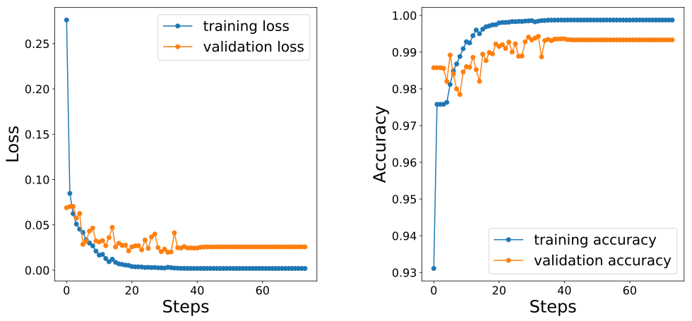

## Results

We implemented the U-Net model using a custom `Tensorflow` model.
We did not use our `Byron` or `NumPyNet` libraries since the training section is very computational expensive and in this project we had the possibility to use a NVidia GeForce RTX 2080 Ti which can be easily managed using a `Tensorflow` implementation [^1].
Also the data augmentation step was performed by the `Tensorflow` framework.
The training performances in terms of loss (*binary CrossEntropy*) and accuracy (we have already mentioned that it is not a good estimator in segmentation task but it is "required" in standard training plot) were shown in Fig. [1](../../../../img/training_perf_good_logs_noaug.svg).

As can be seen in the left plot of Fig. [1](../../../../img/training_perf_good_logs_noaug.svg) the binary cross-entropy loss tends to saturate just after the 40 training epochs and in the same way also the accuracy score reaches its plateau.
We would stress that the accuracy metric is not a good indicator for segmentation applications and it can be proved by the right plot of Fig. [1](../../../../img/training_perf_good_logs_noaug.svg) in which the accuracy value starts from more than 93% in the first iteration, i.e when the model weights are completely random.

Using the tuned weights obtained by the training step we validate our model on the 40 images which compose the test set.
We fed our Neural Network model with each CT slice and we filtered the output [^2] using a thresholding of `10^-2`, i.e the value less or equal to the threshold were turned off.
From each slice the IoU score was computed with the corresponding ground truth, i.e the binary mask extracted with our semi-automatic (and not medically accurate) pipeline.
In Fig. [2](../../../../img/IoU_good_logs_noaug.svg) we show the distribution of IoU score over the 40 test images.

![IoU (Intersection over Union) distribution obtained on the test set. The IoU score quantify the agreement between the binary mask outputs by the U-Net model and the corresponding ground truth. A perfect match corresponds to IoU score equal to 1 and a completely disagreement is given by a null value of IoU score. The 80% of the test set obtained a IoU score greater than 0.8 and thus a good correspondence between our results and the ground truth. We would stress that the ground truth was obtained applying a custom semi-automatic image processing pipeline which was not validated from a bio-medical point-of-view.](../../../../img/IoU_good_logs_noaug.svg)

The major part of the test slices obtained a IoU score greater then 0.8 which corresponds to a good agreement between the model output and ground truth.
Only a 20% (10/40 slices) of the test slices showed a IoU score less than 0.8 and thus a binary mask quite different from the desired output.
In Fig. [3](../../../../img/IoU_score_out_good_logs_noaug.svg) we show some of the good results obtained using our trained model.

Despite the first slice shown in Fig. [3](../../../../img/IoU_score_out_good_logs_noaug.svg) could be easily segmented also by our custom image processing pipeline (the bone extraction in this case is quite easy) the second two slices show more difficult tasks in which it is hard to discriminate between the femur head and the acetabular fossa.
In all these case the U-Net model was able to discriminate between the bones with a good agreement with our naive ground truth.
However, the model still produces some false positive segmentations also in these cases: the output could be corrected re-applying our image processing pipeline and thus filtering the bone identifications outside in disagreement with the connected components centroids obtained by the previous slice.
To completely prove our results we need of more data and certainly more annotation slices but we these preliminary results encourage us to use Neural Network model like the U-Net one to face on the segmentation problems also in bio-medical imaging.

[^1]: We thank the *PhySyCom* group of the Bologna University for its support on this project.

[^2]: The model output is a floating point images with values ranging from 0 to 1. To compare the output with a binary mask we have to apply a threshold procedure to binarize the image.

[**next >>**](../rFBP/README.md)
