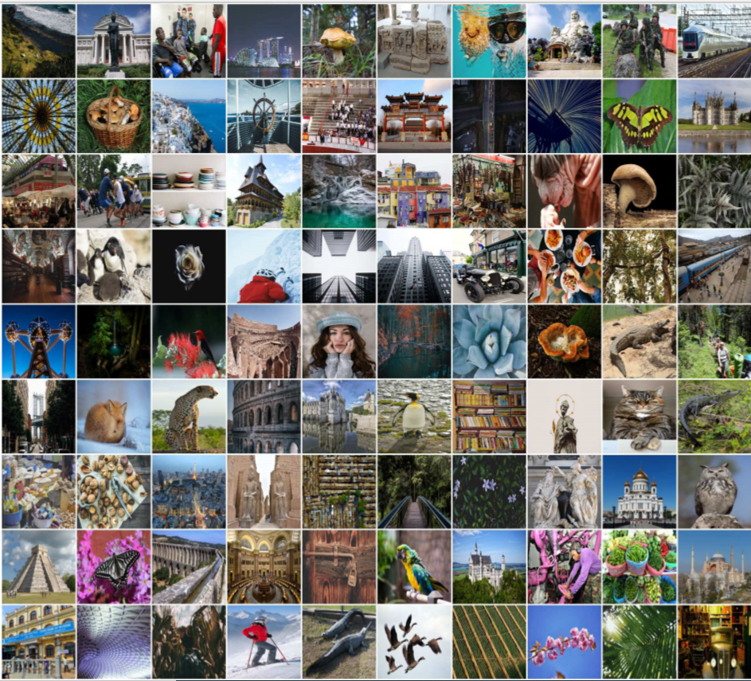

## DIV2K dataset

In our super resolution applications we used as training set the images provided by the DIV2K (*DIVerse 2K resolution high quality images*) dataset [[Agustsson_2017_CVPR_Workshops](www.vision.ee.ethz.ch/~timofter/publications/Agustsson-CVPRW-2017.pdf)].
This dataset was appositely created for the 2017 NTIRE challenge (*New Trends in Image Restoration and Enhancement*).
The NTIRE challenge is an international competition which aims to monitoring the state-of-art in digital image processing and image analysis and it takes place at the CVPR (*Computer Vision and Pattern Recognition*) conference every year.
One of the most important monitored task is the super resolution research progress.
Thus, every year, many research groups propose new super resolution models, mostly based on neural network models, to improve the state-of-art results on this research field.
The challenge is won by the model which performs the higher PSNR value over a validation set extracted on the DIV2K dataset.
For these reason the DIV2K dataset is considered as a standard for super resolution applications.

The dataset contains 800 high-resolution images as training set and their corresponding low-resolution ones, obtained by different down-sampling methods and different scale factors (2, 3, and 4).
A second set of 100 high-resolution images makes the test set on which the model can evaluate its accuracy: also this second set of images have their low-resolution counterpart.
Finally, a third group of 100 images constitutes the validation set, i.e they are blinded images without their corresponding high resolution counterpart, and they are used to evaluate the results of the models in race.

All the 1000 images are 2K resolution, i.e width and height dimensions must have at least 2K pixels.
The images are collected paying particular attention to the quality, diversity of sources (web sites and cameras) and contents.
The DIV2K images, in fact, collect a large diversity of contents, ranging from people, handmade objects and environments (cities, villages) to natural sceneries (including underwater and dim light conditions) and flora and fauna.
In each image we can find more or less complex shapes, geometries and also some words.
We would stress that no one bio-medical image is contented in the dataset since it is very difficult obtain high quality images of this kind (let alone the problems about copyrights and releases).

In our SR applications we used pre-trained [^1] neural network models on the DIV2K and we tested their performances on NMR (Nuclear Magnetic Resonance) images.
The models have never seen this kind of images but during the training they learned a large quantity of shapes that can be "found" also in bio-medical images.
The bio-medical images were provided by the collaboration with the MRPM group of the Physics Department of the University of Bologna and the Bellaria Hospital of Bologna.
We thank the volunteers who perform the NMR acquisitions and shared their data.

[^1]: The developed models were not re-trained due to limited time and low computational architectures available.

[**next >>**](./Result.md)
