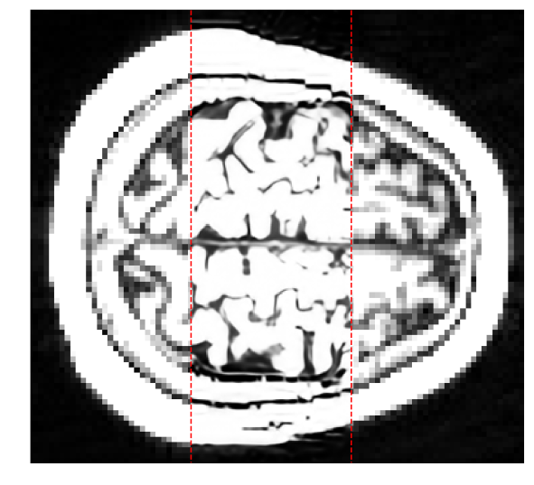
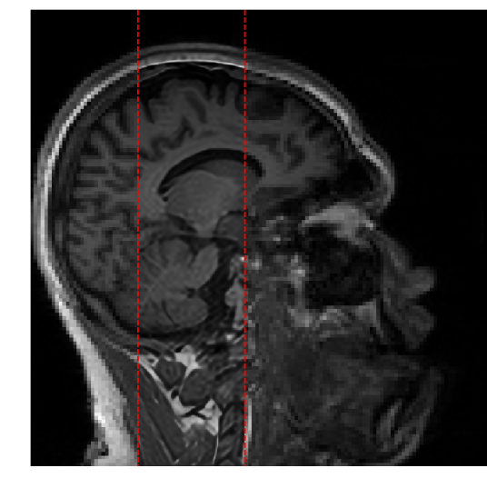

## Super Resolution

|  |  |
|:----:|:-----:|

The Super Resolution (SR) is a slight novel technique based on Neural Network models which aims to improve the spatial resolution of a given image [^1].

The first SR methods on digital images estimate the high frequency information of the images starting from a series of low-resolution (LR) patches and their high-resolution (HR) counterpart.
These patches (ROIs of the LR image commonly smaller than `50 x 50`) were extracted after an edge enhancement procedure or a simple 2D Fourier transform which extract the high frequency information.
Collecting these patches an "association dictionary" between LR and HR was created.
This dictionary was so used to learn the correct association between the LR e HR counterpart and then applied on new images.
The considered images could also be of the same dimensions in these firstly applications, i.e the purpose was only to improve the spatial resolution of the image without changing the sampling step.

The idea of use neural network models and in particular convolution functions to face on this problem was born in 2014 at the Engineering University of Honk Kong due to the large popularity of these models during that years.
The increasing computational power allowed to create automatic models able to learn the LR-HR association without any dictionary.
In this year arise the SRCNN model [[SRCNN](https://ui.adsabs.harvard.edu/\#abs/2015arXiv150100092D)], a three-layer neural network able to learn a large ensemble of features to reproduce the desired association.
The first layer aimed to extract the LR patches from the input image; the second layer produce the association between the LR patches and the tuned HR ones; the last layer reorganized the HR patches ensemble produced into a single HR image, i.e the output.

From this starting implementation many improvements was performed in this research field but the fundamental idea is not changed.
Modern models simply have a greater number of layers, due to the increasing computational power availability, and they used appropriate workaround to overcome the (large-)parameters tuning problem.

In the next sections we will show the super resolution technique step-by-step starting from the image pre-processing until the most modern algorithmic solutions.
At the end of this chapter the `NumPyNet` and `Byron` implementation of some modern models will be presented and applied over biomedical images.

[^1]: The best-known "implementation" of Super Resolution concerns the microscopy super-resolution. In this work we are focusing on algorithms and numerical implementation so we will talk about the numerical counterpart of this technique, totally ignoring the original "hardware" version.

[**next >>**](./Resampling.md)