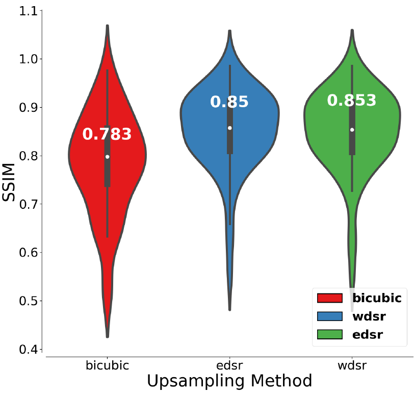
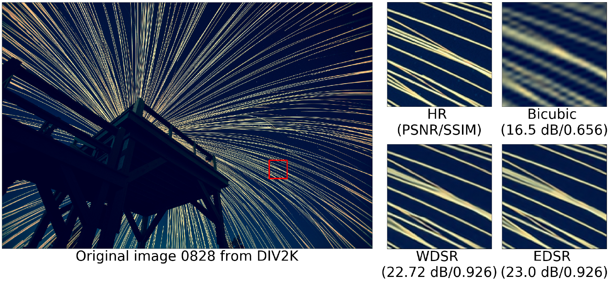
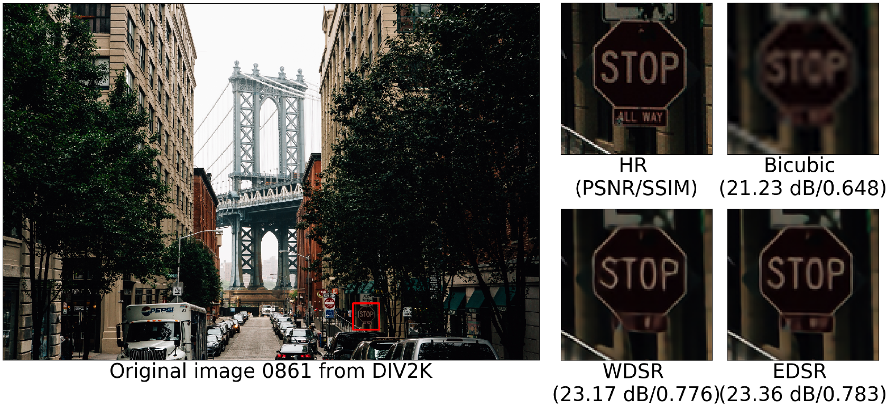
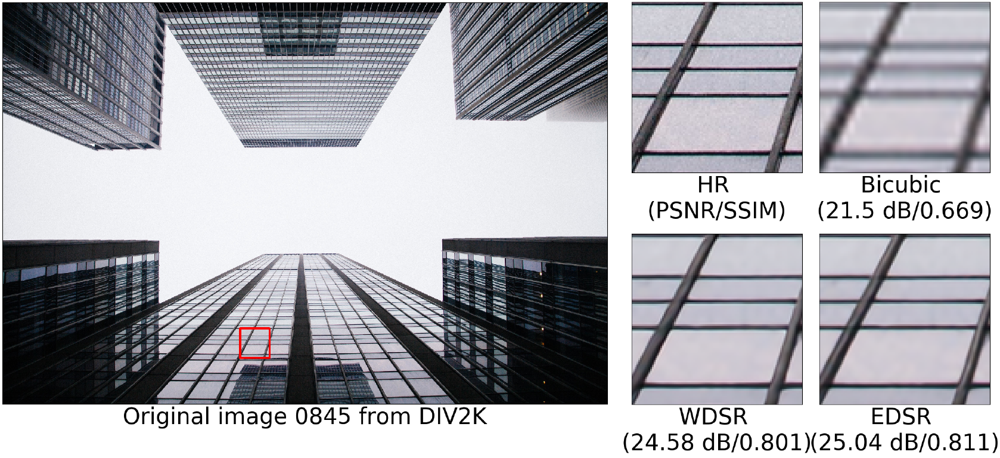

## Results

As discussed in the previous sections we implemented the EDSR and WDSR models into our custom `Byron` library but we did not re-trained the models.
The trained weights used in this work were taken from the official implementation of the models publicly available on the corresponding Github pages([EDSR](https://github.com/thstkdgus35/EDSR-PyTorch) and [WDSR](https://github.com/JiahuiYu/wdsr_ntire2018)).

First of all we tested our implementation in terms of execution time.
The official implementations are written using `Tensorflow` and `PyTorch` frameworks and they are usable only with a GPU support.
Thus no test were performed in relation to them but only between the two models inside the same `Byron` framework.

We started our numerical tests comparing the efficiency of the two models keeping fixed the input sizes.
In this way we could reproduce what already proved by the original paper, i.e the numerical efficiency of the WDSR model against its predecessor EDSR one.
In particular over 100 runs we could easily prove that the WDSR model is more than 10x faster than EDSR, due to the discussed properties explained in the previous section.

A second analysis was performed on the performance efficiency of both the models over a validation set of images.
We evaluated the two quality scores described in the above sections (PSNR and SSIM) over the validation set provided by the DIV2K dataset.
The full validation set comprises 60 images and we compared the efficiency of the two models against the standard up-sampling technique given by the bi-cubic algorithm.
In Fig. [1](../../../../img/sr_val_psnr.png) we show the score distributions obtained using the three methods over these 60 images.

As can be seen by the two plots in Fig. [1](../../../../img/sr_val_ssim.png) the quality improvement given by the Super Resolution methods against the bi-cubic algorithm is evident.
On the other hand the gap between the two Super Resolution models is relatively small: the EDSR model performs statistically better than the WDSR one but we have also to take into account that the WDSR model has less than 10% of the EDSR parameters.
Moreover we have to considering the combination between performances and execution time: in this case the WDSR is certainly the best choice for Super Resolution applications.

A visual proof of our results is shown in Fig. [1](../../../../img/sr_res1.png), [2](../../../../img/sr_res2.png), [3](../../../../img/sr_res3.png): as discussed in the previous sections, the visual comparison is certainly the more accurate score for super resolution applications.
As can be seen in Fig. [1](../../../../img/sr_res1.png) and Fig. [2](../../../../img/sr_res2.png) the two models have perfectly learned how to reconstruct the complex line shapes of the input image.
At the same time they also learned ho to reconstruct words and different kind of textures.
These results highlight either the efficiency of the two models either the importance of the training set for this kind of applications: the DIV2K dataset has a wide heterogeneity of different textures inside its images and thus the model is able to perfectly reconstruct a huge amount of different shapes after the training section.

The obtained results encouraged us to test the efficiency of the two models also with different kind of images.
In particular we tested their quality score performances on NMR images of human brain.
The images were provided by the Bellaria Hospital but due to privacy constrains we can show the results only on a single set of them [^1].

We used a series of T1 weighted NMR images sampled with a spatial frequency of 1 mm in each direction (`x`, `y`, `z` with a resolution of `256 x 256` pixels).
The images were down-sampled to `128 x 128` (2x down-sampling) and to `64 x 64` (4x down-sampling).
Then both the down-sampled series were re-up-sampled to the starting dimensions using the EDSR (2x) and WDSR (4x) models.
Also in this case the results were compared to a standard bi-cubic up-sampling algorithm.
The data acquisition included 176 slices and each one was independently processed.
The results obtained by the 2x and 4x up-sampling are shown in Fig. [4](../../../../img/sr_psnr_ssim_x2.svg) and Fig. [5](../../../../img/sr_psnr_ssim_x4.svg), respectively.

![PSNR (left) and SSIM (right) quality scores obtained by the EDSR model on the 2x NMR slices of the human brain. We compared the efficiency of the EDSR model with the results obtained by a standard bi-cubic up-sampling. The Super Resolution model is able to better reconstruct the brain shapes and textures and thus obtain a higher image quality score in the major part of the slices. The critical points, i.e where the bi-cubic up-sampling performs better than the super resolution algorithm, are highlighted in the plot and they correspond to the less informative area of the brain.](../../../../img/sr_psnr_ssim_x2.svg)

![PSNR (left) and SSIM (right) quality scores obtained by the WDSR model on the 4x NMR slices of the human brain. We compared the efficiency of the WDSR model with the results obtained by a standard bi-cubic up-sampling. The Super Resolution model is able to better reconstruct the brain shapes and textures and thus obtain a higher image quality score in the major part of the slices. The critical points, i.e where the bi-cubic up-sampling performs better than the super resolution algorithm, also in this case correspond to the less informative area of the brain.](../../../../img/sr_psnr_ssim_x4.svg)

In both cases the Super Resolution models over-performed the bi-cubic algorithm in the major part of the slices.
The only exception is given by the 2x results in which there were a set of slice in which the bi-cubic efficiency was higher than the super resolution one in term of SSIM quality score.
As can be seen in Fig. [4](../../../../img/sr_psnr_ssim_x2.svg) the efficiency of the EDSR model decreased in the first and last parts of the acquisition: the corresponding slices are highlighted in the plot and we can easily notice that they corresponded to the less informative portions of the brain.
The most central and thus informative from a bio-medical point-of-view part was better reconstructed by the Super Resolution models.
We would stress that an increment of 0.25 in the PSNR score is visible by naked eyes.
The images shown at the beginning of this section (ref. Fig. [-1](../../../../img/sr_wow.svg)) were obtained using the WDSR model over our images and they visibly highlight the efficiency of our Super Resolution models.

In conclusion this work proved how we can obtain good results without need to re-train a Neural Network model.
The presented models are, in fact, able to generalize the learning patterns and textures also to different image kinds.
The PSRN and SSIM performances obtained by the NMR image reconstructions are also in agreement with the results obtained on the DIV2K validation set and they confirm the goodness of the DIV2K dataset as training set for Super Resolution applications.
Further analyses are still in work in progress and these results encourage us to test our trained models also on wider bio-medical datasets.

[^1]: I'm the "patient" in this acquisition.

[**next >>**](../ObjectDetection/README.md)
