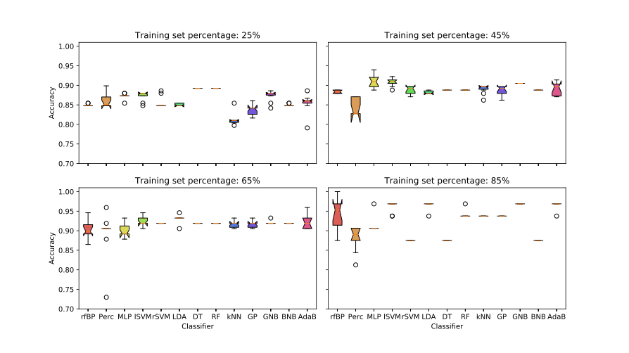
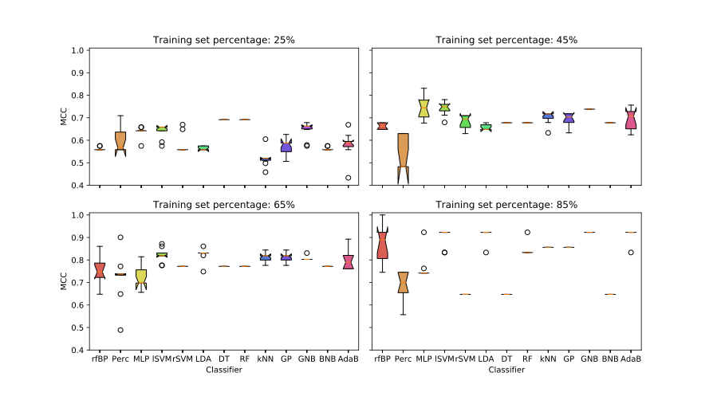

## Results

With the tuned hyper-parameters we performed the training of rFBP algorithm on different percentages of the training set: 25%, 45%, 65% and 85%.
In the same way we trained also a list of the most common Machine Learning classifiers: single perceptron with floating-point weights (Perc); standard Neural Network with gradient descent as updating rule (MLP); support vector machine with linear kernel (lSVM); support vector machine with radial kernel (rSVM); linear discriminant analysis (LDA); decision tree (DT); random forest (RF); k-nearest neighbors with 2-clusters (kNN); Guassian process (GP); diag-quadratic discriminant analysis (GNB); Bernoulli naive bayes (BNB); AdaBoost (AdaB).
For each training percentage we performed the hyper-parameters optimization of each classifier with the same number of optimization steps.
In Fig. [1](../../../../img/Ale_ACC_confrontoNicoPhD.svg) [2](../../../../img/Ale_MCC_confrontoNicoPhD.svg) the accuracies and MCC results are shown, respectively.

From this analysis we can conclude that the rFBP algorithm shows comparable performances with the other classifiers.
These performances globally grow with the training set size but only the rFBP was able to reach a "perfect learning" configuration, i.e accuracy of 100% and MCC=1.
We have also noticed that the rFBP classifier and the GNB were the only two algorithms which qualitatively does not show performance saturation on their training.

A second analysis was performed on the data distribution using a multiple $$\chi^2$$-test.
Starting from the whole set of genomes we can compute the contingency-matrix of the two classes [^1].
The $$\chi^2$$-test was performed on the full set of `8189,bp` and so the extracted *p-values* were corrected according multiple-tests.
Using the Sidàk [[Sidak1967](http://www.jstor.org/stable/2283989)] correction method and by the definition of significant threshold of 0.05 we found 1103 significant bases.
An analogous $$\chi^2$$-test was performed on the rFBP weights to identify a putative correlation between a set of weights and mutated bases.
This second $$\chi^2$$-test was performed only on the simulation which involved the 85% of data as training set because it was the case in which the rFBP algorithm shows the better performances than the other classifiers.
We firstly defined a base as significant if its corresponding p-value was less or equal than 0.05: in this way we could associate to each base a numerical weight of 0 if it was not significant an `+1` or `-1` if it was, where `+1` identified the pig class and `-1` the other one.
The set of weights defined following these instruction could be associated to the \quotes{ideal set}.
In this way we could ensure that if the corresponding `rFBP` weights were equal to `+1` in all the significant positions (and thus in all the significant bases) for the pig class, the model output would be `+1` and `-1` in the opposite case.
This mechanism follows the Simple Perceptron algorithm scheme (ref. [Perceptron](../NeuralNetwork/Perceptron.md)) in which each weight is associated to a given entry of the input samples.
The rFBP algorithm follows the same rules with an activation function given by the Heaviside $$\Theta$$ and it changes only the updating rule.
Moreover, following this method we could ensure that only the `1103` significant bases extracted were associated to a not null weight.

We took into account the 10 weights set extracted by the 10-Fold cross validation performed to extract the previous results.
From these 10 sets we extracted the representative one using a simple average of their values: each weight entry was computed as the mean of the 10 weight realizations.
In this way each weight entry was converted to a floating point number and we can easily extract the set of weights perfectly equal to $$\pm1$$.
From our analyses 5201 weights were consistently equal to $$\pm1$$ in all the simulations, i.e the algorithm assigned to 5201 weights always the same value.
In this way we could consider these weight entries as the significant positions identified by the rFBP algorithm.

These rFBP significant weight set could be compared to the $$\chi^2$$ ideal set.
From this comparison we noticed a good agreement between the two sets: the major part of the significant bases for the $$\chi^2$$ multiple test could be found also in the significant weights identified by the 10 realizations of the rFBP algorithm.
In particular, we found that `838/841` bases were significant for both the methods.
The rFBP algorithm correctly identified `838/848` significant bases related to the `-1` class and only `3/255` bases related to the `+1` class.

In conclusion, we could prove that the rFBP algorithm is able to identify the major part of the significant mutations in the training set.
However, the use of the only training set to extract the significant weights certainly penalized the rFBP algorithm and a second simulation (without prediction purposes) was performed considering the full set of data, i.e 10 realizations without cross-validation.
In this second case the rFBP significant weights correctly identified `702/1103` where `696/848` were related to the `-1` class and `6/255` to the `+1` class.
In both cases we could conclude that the dataset did not contain enough information for the `+1` class identification for the rFBP algorithm.

Following the above results, a final training was performed using only the significant bases identified by the rFBP algorithm and only the significant bases extracted by the $$\chi^2$$ multiple test, using the full set of available classifiers.
We noticed how the performances of all the classifiers are significantly better using the bases extracted by the rFBP algorithm (always over the 87% of accuracy) than the results obtained considering the $$\chi^2$$ significant bases (only few classifier were able to obtain more than 85% of accuracy).

We conclude that our results highlight the efficiency of the rFBP algorithm for genome analyses and SNPs classification problems.
Moreover we could propose also the rFBP algorithm as a valid feature selection alternative to classical statistical tests.
These results also encourage us to further investigate about the biological meaning of the significant bases identified.

[^1]: The contingency-matrix displays the (multivariate) frequency distribution of variables. Each row counts the number of hosts with/without the SNPs. Each column identifies a class.

[**next >>**](../Chapter3/README.md)