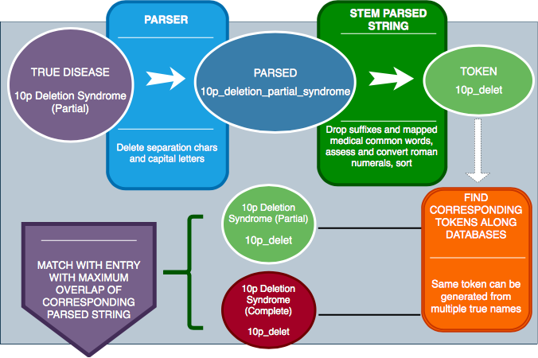

## CHIMeRA datasets

We have seen how we can extract useful informations also from unstructured websites using a web-scraping pipeline.
The *on-line doctor* web pages could be very useful for a toy model application like the SymptomsNet one [^1] but if we want produce scientific relevant results we have to take care about the validity of the data.
Since the English dataset availability is easier than the Italian one we moved to more "robust" databases.

As told in the previous sections, there are a lot of studies performed on the disease associations to other biological compounds and in many cases the resulting datasets are public available on Internet.
This is the case of the [DisGeNET]() or [DrugBank]() datasets which contain the relations between a large number of diseases with genes/variants and drugs, respectively.
The DisGenet [web-page](https://doi.org/10.1093/nar/gkw943) allows the download of the datasets already stored into a well structured network format (sparse adjacent matrix) while the DrugBank poses more issues to the treatment of data: the DrugBank database was designed to provide a large set of informations related to each drug inserted using its own website and thus it needs a pre-processing of the JSON dataset structured to highlight all the possible network associations.
Using the DisGenet we can connect the diseases to the related genes and variants.
From the reviewed format of the DrugBank, instead, we can link each disease to the consequential drugs.
Associated to each drug we have also a list of gene and SNP targets which can be merged to the informations provided by DisGenet.
Moreover, we can also connect food treatment to each drug and take care to the interactions between drugs (their synergy or not).
We would stress that despite the trivial overlaps between the same data sources (genes, diseases and SNPs up to now), just using the rearrangement of these pair of datasets into a network structure, we can already provide a possible extrapolation of the underlying informations using the paths between nodes.
Starting from a disease inside the DisGenet, using this single database we can study the "causality" relation to the connected genes.
Using a multiple databases approach we can map that disease to other kind of informations like drugs or foods: in this way we can also hypothesize a direct relation between that drug or food with the above told gene passing through the disease node (2-step connection).
In other words, the network structure allows the inference of missing connections using node contraction and this can be achieved only by merging multiple data sources.

To enlarge our informations about a disease we looked for other on-line data sources.
A very interesting database is given by [HMDB]() (*Human Metabolite Data Bank*) which comprises a vast amount of metabolite and metabolite-pathway with the associated drugs and disease.
The interconnection with the previous discussed datasets is straightforward but in this case the data are not public available with but we had to apply a web-scraping algorithm to get its informations.
An analogous procedure was applied to extract the data included into the [RXList](https://www.rxlist.com/script/main/hp.asp) database.
RXList is an on-line website very similar to the previous discussed auto-diagnosis tools in which we can find associations between diseases and drugs.
In this case we have a further distinction between diseases: we have diseases related to drugs and diseases connected to other caused-diseases.
This further association can be modeled using directional links [^2].

All these informations can enrich our database and the description of a given disease but we have to face on the problem of data merging.
As previously discussed we do not have a unique nomenclature for diseases and thus we can find analogous names (periphrases or synonyms) which identify the same concept (disease).
A useful tool to overcome these issues could be given by a synonym dictionary: a powerful example is given by the [CTD]() (*Comparative Toxicogenomics Database*).
Thus we mined using another web-scraping pipeline also this database in which we could find associations between diseases and synonyms added to a list of phenotypes associated to each one.
Using the CTD jointly with the [SNAP]() (*Stanford Large Network Dataset Collection*) [^3] database we could enlarge the number of synonyms associated to each disease name.

A full list of the informations collected by our web-scraping and rearrangement pipelines is shown in Fig. [2](../../../../img/Chimera_db_sources.png)

We remember that the crucial point of our merging procedure is given by the disease nodes since they are the node type shared between all the databases.
The help given by the synonym dictionaries certainly increase the overlap between the mined datasets but we chose to maximize it using a pre-processing NLP pipeline.
So we started our pipeline using a word *standardization*, i.e converting all the words into their lower cases and replacing all the punctuation characters with a unique one [^4].
Then we noticed that a not negligible part of words involved into the disease names was useless for the description: words like "syndrome", "disease", "disorder", "deficiency", ... are not descriptive and so we can filter them.
Now we can split the disease name into a series of token according to the list of words which compose it (*tokenization*).
Each list of words is then sorted.
To further increase the overlap we cut the inflected words to their root form using a *stemming* algorithm: the stemmer strength has to be tune according to the desired result so a first processing was performed using a `Lancaster` stemmer (more aggressive) but if the resulting output was too short to be compared with other names we changed it with a `Porter Snowball` stemmer (less aggressive).
The stemmer algorithm choice is a very crucial task for NLP because using it we drastically loose word informations.
Other processing steps were performed for critical cases encountered during the analyses: these steps constrain the developed pipeline and they were lost in generalization to other datasets.
The work-flow outputs include multiple false-positive matches (ref. Fig. [2](../../../../img/chimera_pipeline.png)) and to remove them we can compare them to the original occurrences to evaluate a score match.
This can be achieved introducing the standard word metrics: a common distance between words can be evaluated using the *Levenshtein Distance* which follows the equation

$$
d_{a, b}(i, j) = \left\{ \begin{array}{rc}
  \max(i, j)                                                       & \mbox{if} \min(i, j) = 0 \\
  \mbox{min} \left\{ \begin{array}{r}
      d_{a, b}(i - 1, j) + 1                     \\
      d_{a, b}(i, j - 1) + 1                     \\
      d_{a, b}(i - 1, j - 1) + 1_{(a \neq b)}    \\
    \end{array}
    \right.                                                        & \mbox{otherwise}         \\

  \end{array}
  \right.
$$

where `a` and `b` are two strings of length `|a|` and `|b|` respectively.
The *indicator function* $$1_{(a \neq b)}$$ is equal to `0` when $$a_i = b_j$$ and `1` otherwise.
In this way the Levenshtein distance between `a` and `b` can be computed evaluating the distance between the first `i` characters of `a` and the first `j` characters of `b`.

A scheme of our custom pipeline is shown in Fig. [2](../../../../img/chimera_pipeline.png)).

[^1]: Also because no other databases were provided for the Italian language!

[^2]: For sake of clarity, we encountered the same condition also into the DrugBank dataset in which we had internal connections between drugs.

[^3]: Extracted using another web-scraping pipeline.

[^4]: An unexpected issue arise in this step: different databases use different enumeration system. In some entries we found disease names associated to numbers which identify their multiple types. An example could be "Polyendocrine Autoimmune Syndrome type 1" but at the same time in a second database the same disease could be represented by "polyendocrine autoimmune TYPE I". Despite the global differences between the two names, given in this case by upper- and lower-cases of some letters and the deletion of some words, a very critical odds is the enumeration style. The performances of our pipeline dramatically increased using a `roman_number_converter` algorithm.

[**next >>**](./CHIMeRA.md)

