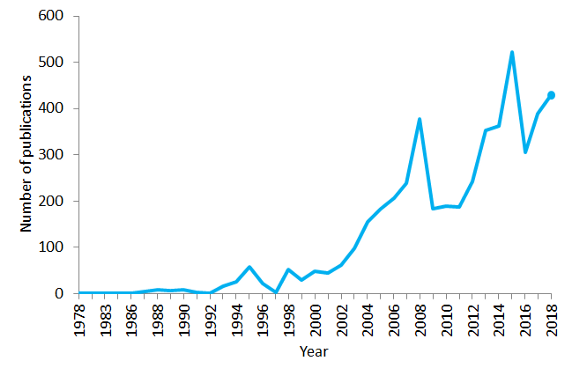

## Natural Language Processing



Natural Language Processing (NLP) is a quite novel research field driven by the increasing availability of textual data (ref. Fig. [1](../../../../img/pubmed_nlp.png)).
As told in the previous sections the incoming of Internet world exponentially increase the amount of data shared by people and the major part of them are textual data, i.e data composed by words, phrases and more in general texts.
The NLP joins together techniques coming from the linguistic, computer science, information theory and artificial intelligence researches and it concerns the interactions between human languages and computers, or in other words it studies how a computer can analyze a huge amount of natural language data and how it could extract numerical information from them.
This is a very hard task to perform since it is not straightforward to teach to a machine how humans communicate between them so a key role is played by the artificial intelligence researches in the developing of new algorithmic techniques.
The final purpose of the NLP is, in fact, to read, decipher, understand and make sense of the human languages extracting valuable and numerical results.

Most of the modern NLP techniques are based on a Machine Learning approach to the problem and thus we can find statistical methods against deep learning neural networks trained to face these kind of problems.
A first step has to be performed to convert the human speech into a machine readable input; then the audio signal is converted into a string text and only at the end the text can be analyzed from the machine.
Applying this work-flow in forward and reverse mode we can perform a communication between a human and a machine and vice versa.
In this section we will ignore how the conversion from human voice to numerical inputs could be performed and its related problems and solutions but we will focusing on the last part of this pipeline, i.e in the description of the most common techniques to process a string text into numerical values.
This is also the case related to our `CHIMeRA` project, in which we have a huge amount of names and strings related to medical terms and we want to standardize and increase their overlap.

First of all we have to take care that each human language has its own characteristics and thus it is harder to create to a pipeline ables to process all the languages at the same time while it is easier to tune an algorithm on a particular language.
In our work we were focused on the Italian language (`SymptomsNet`) and on the English language (`CHIMeRA` Network).
Since the `SymptomsNet` project was developed as simple proof of concepts, the developed Italian pipeline was really naive and for sake of brevity we will focus only on the `CHIMeRA` pipeline, i.e the English one.
We would stress that in our application we were not interested on the understanding of the words meaning but we want to minimize the word heterogeneity maximizing their overlap.
In this way we can ignore the semantic meaning of the strings and we could focus only on their syntaxes.

The syntax is the set of rules, principles, and processes that govern the structure of sentences in a given languages.
In this way we can create group of words applying grammatical rules: the grammatical rules have to be converted into algorithms which take in input a word and they give in output a processed version of the same word.
In this case there is not a numerical output but just a reorganization of the string letters and words.
The most common techniques involved in the syntactic analysis are:

* **Sentence breaking:** it divides a continuous text into sentences placing boundaries.
* **Word segmentation (tokenization):** it splits a large set of continuous text into units.
* **Parsing:** it provides the grammar analysis of the provided sentence.
* **Morphological segmentation:** it splits words into individual units called morphemes.
* **Part-of-speech tagging:** it identifies the grammatical part of speech for every word.
* **Lemmatization:** it reduces the inflectional forms of a word into a single form.
* **Stemming:** it cuts the inflected words to their root form.

All these algorithms are very closed each other so to better understand their functionality is useful an example.
Lets start from a dummy text taken from the NLP [Wikipedia](https://en.wikipedia.org/wiki/Natural_language_processing) web-page:

```python
text = "Natural language processing (NLP) is a subfield of linguistics, computer science, information engineering, and artificial intelligence concerned with the interactions between computers and human (natural) languages, in particular how to program computers to process and analyze large amounts of natural language data. Challenges in natural language processing frequently involve speech recognition, natural language understanding, and natural language generation."
```

First of all we notice that the text is made by two sentences that can be broke using a *sentence breaking* algorithm.
In this way we obtain a list of two strings given by

```python
sentence_1 = "Natural language processing (NLP) is a subfield of linguistics, computer science, information engineering, and artificial intelligence concerned with the interactions between computers and human (natural) languages, in particular how to program computers to process and analyze large amounts of natural language data."

sentence_2 = "Challenges in natural language processing frequently involve speech recognition, natural language understanding, and natural language generation."
```

Now we can divide each sentence into its set of words using a word *tokenization*.
Focusing only on the first sentence we obtain in output:

```python
tokens = ['Natural', 'language', 'processing', '(', 'NLP', ')', 'is', 'a', 'subfield', 'of', 'linguistics', ',', 'computer', 'science', ',', 'information', 'engineering', ',', 'and', 'artificial', 'intelligence', 'concerned', 'with', 'the', 'interactions', 'between', 'computers', 'and', 'human', '(', 'natural', ')', 'languages', ',', 'in', 'particular', 'how', 'to', 'program', 'computers', 'to', 'process', 'and', 'analyze', 'large', 'amounts', 'of', 'natural', 'language', 'data', '.']
```

There are multiple useless tokens in the processed list and we can filter them using a type of *part-of-speech tagging* algorithm which removes the so-called *stop words* and punctuations.
In our example our list of tokens become

```python
tokens = ['Natural', 'language', 'processing', 'NLP', 'subfield', 'linguistics', 'computer', 'science', 'information', 'engineering', 'artificial', 'intelligence', 'concerned', 'interactions', 'computers','human', 'natural', 'languages', 'particular', 'program', 'computers', 'process', 'analyze', 'large', 'amounts', 'natural', 'language', 'data']
```

A final step could be given by the *stemming* algorithm which extract the root form of each word.
Using the stemmer on the previous set of words we obtain

```python
tokens = ['natur', 'languag', 'process', 'nlp', 'subfield', 'linguist', 'comput', 'scienc', 'inform', 'engin', 'artifici', 'intellig', 'concern', 'interact', 'comput', 'human', 'natur', 'languag', 'particular', 'program', 'comput', 'process', 'analyz', 'larg', 'amount', 'natur', 'languag', 'data']
```

As can be seen by this example the stemming algorithm convert in lower case each letter of each words and remove the inflections from each of them.
This is a very naive example but we can already notice as our processing allow to merge multiple words together.
In the original sentence we have the word "*Natural*" (with capital letter) and two occurrences of "*natural*" (lower case).
Moreover, we have three occurrences of the "*computer*" word but only two of them are in singular form.
The tokenization + stemming processing allows to compare standardize the different word forms making them compatible.

Combinations of these algorithms can be find in everyday applications starting from email assistants or website chat box to the more advanced sentimental analyses and fake news identifiers [[IJST119594](http://www.indjst.org/index.php/indjst/article/view/119594), [MitaliSentiment2016](https://www.researchgate.net/publication/312559872_Techniques_for_sentiment_analysis_of_Twitter_data_A_comprehensive_survey), [sharma2019combating](https://arxiv.org/abs/1901.06437), [zhou2018fake](https://arxiv.org/abs/1812.00315)].
NLP pipelines are used also in biomedical applications and the modern multinational companies like Amazon, IBM or Google are financing different kinds of research on this topic.
[Amazon Comprehend Medical](https://aws.amazon.com/it/comprehend/medical/) is a NLP service developed by Amazon to extract disease conditions, medications and treatment outcomes from patient notes, electronic health records and other clinical trial reports.
At the same time also companies like Yahoo and Google based their filters and email classifiers on NLP algorithms to stop spam.
Also the fake news hot topic of the these years is faced on by NLP pipeline and the NLP Group at MIT is developing new tools to determine if a source is accurate or politically biased based on analyses of texts.

In our applications we constructed a custom pipeline based on part of these algorithms.
In the following sections we will describe in detail our pipeline which was tuned for our case study: we would stress that the efficiency of our pipeline could not be generalized to other datasets since our purpose was to obtain the best result for our applications.
In other words, we can say that we had fine-tuned our pipeline based on the data used in this project.
Moreover we have to clarify that our pipeline is not fully-automatic but it was made according to a semi-supervised approach: we customize the work-flow following the issues showed by our applications.


[**next >>**](./Dataset.md)

